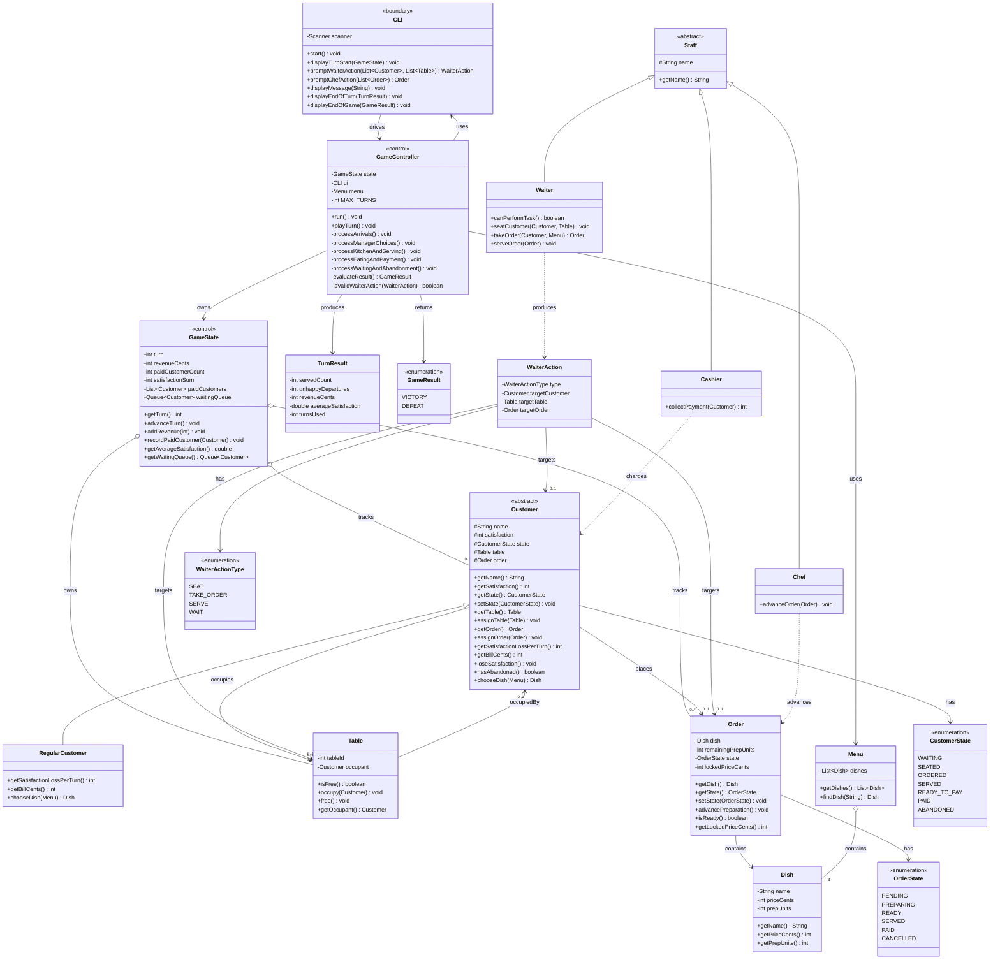

# Stage 1 Class Diagram

```mermaid
classDiagram
    direction TB

    %% ================= BOUNDARY =================
    class CLI {
        <<boundary>>
        -Scanner scanner
        +start() void
        +displayTurnStart(GameState) void
        +promptWaiterAction(List~Customer~, List~Table~) WaiterAction
        +promptChefAction(List~Order~) Order
        +displayMessage(String) void
        +displayEndOfTurn(TurnResult) void
        +displayEndOfGame(GameResult) void
    }

    %% ================= CONTROL =================
    class GameController {
        <<control>>
        -GameState state
        -CLI ui
        -Menu menu
        -int MAX_TURNS
        +run() void
        +playTurn() void
        -processArrivals() void
        -processManagerChoices() void
        -processKitchenAndServing() void
        -processEatingAndPayment() void
        -processWaitingAndAbandonment() void
        -evaluateResult() GameResult
        -isValidWaiterAction(WaiterAction) boolean
    }

    class GameState {
        <<control>>
        -int turn
        -int revenueCents
        -int paidCustomerCount
        -int satisfactionSum
        -List~Customer~ paidCustomers
        -Queue~Customer~ waitingQueue
        +getTurn() int
        +advanceTurn() void
        +addRevenue(int) void
        +recordPaidCustomer(Customer) void
        +getAverageSatisfaction() double
        +getWaitingQueue() Queue~Customer~
    }

    class TurnResult {
        -int servedCount
        -int unhappyDepartures
        -int revenueCents
        -double averageSatisfaction
        -int turnsUsed
    }

    class GameResult {
        <<enumeration>>
        VICTORY
        DEFEAT
    }

    %% ================= ENTITY: PEOPLE =================
    class Customer {
        <<abstract>>
        #String name
        #int satisfaction
        #CustomerState state
        #Table table
        #Order order
        +getName() String
        +getSatisfaction() int
        +getState() CustomerState
        +setState(CustomerState) void
        +getTable() Table
        +assignTable(Table) void
        +getOrder() Order
        +assignOrder(Order) void
        +getSatisfactionLossPerTurn() int
        +getBillCents() int
        +loseSatisfaction() void
        +hasAbandoned() boolean
        +chooseDish(Menu) Dish
    }

    class RegularCustomer {
        +getSatisfactionLossPerTurn() int
        +getBillCents() int
        +chooseDish(Menu) Dish
    }

    class Staff {
        <<abstract>>
        #String name
        +getName() String
    }

    class Waiter {
        +canPerformTask() boolean
        +seatCustomer(Customer, Table) void
        +takeOrder(Customer, Menu) Order
        +serveOrder(Order) void
    }

    class Chef {
        +advanceOrder(Order) void
    }

    class Cashier {
        +collectPayment(Customer) int
    }

    %% ================= ENTITY: OPERATIONS =================
    class Table {
        -int tableId
        -Customer occupant
        +isFree() boolean
        +occupy(Customer) void
        +free() void
        +getOccupant() Customer
    }

    class Order {
        -Dish dish
        -int remainingPrepUnits
        -OrderState state
        -int lockedPriceCents
        +getDish() Dish
        +getState() OrderState
        +setState(OrderState) void
        +advancePreparation() void
        +isReady() boolean
        +getLockedPriceCents() int
    }

    class Dish {
        -String name
        -int priceCents
        -int prepUnits
        +getName() String
        +getPriceCents() int
        +getPrepUnits() int
    }

    class Menu {
        -List~Dish~ dishes
        +getDishes() List~Dish~
        +findDish(String) Dish
    }

    %% ================= ENUMS =================
    class CustomerState {
        <<enumeration>>
        WAITING
        SEATED
        ORDERED
        SERVED
        READY_TO_PAY
        PAID
        ABANDONED
    }

    class OrderState {
        <<enumeration>>
        PENDING
        PREPARING
        READY
        SERVED
        PAID
        CANCELLED
    }

    class WaiterActionType {
        <<enumeration>>
        SEAT
        TAKE_ORDER
        SERVE
        WAIT
    }

    class WaiterAction {
        -WaiterActionType type
        -Customer targetCustomer
        -Table targetTable
        -Order targetOrder
    }

    %% ================= RELATIONSHIPS =================
    CLI --> GameController : drives
    GameController --> GameState : owns
    GameController --> CLI : uses
    GameController --> Menu : uses
    GameController --> TurnResult : produces
    GameController --> GameResult : returns

    GameState o-- "0..*" Customer : tracks
    GameState o-- "0..*" Table : owns
    GameState o-- "0..*" Order : tracks

    Staff <|-- Waiter
    Staff <|-- Chef
    Staff <|-- Cashier

    Customer <|-- RegularCustomer

    Customer --> "0..1" Table : occupies
    Customer --> "0..1" Order : places
    Customer --> CustomerState : has

    Table --> "0..1" Customer : occupiedBy

    Order --> Dish : contains
    Order --> OrderState : has

    Menu o-- "3" Dish : contains

    Waiter ..> WaiterAction : produces
    WaiterAction --> WaiterActionType : has
    WaiterAction --> "0..1" Customer : targets
    WaiterAction --> "0..1" Table : targets
    WaiterAction --> "0..1" Order : targets

    Chef ..> Order : advances
    Cashier ..> Customer : charges
```